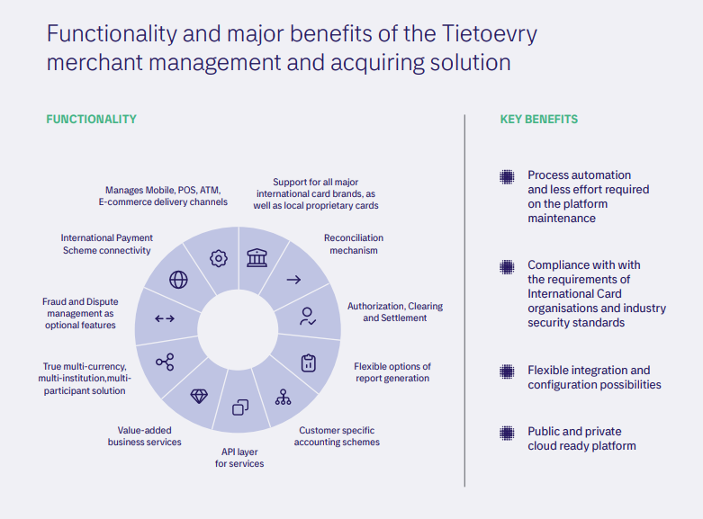

# Tietoevry Acquiring Solution Overview

Tietoevry's acquiring platform helps banks and payment institutions build end-to-end acquiring capabilities. Built on an open, microservices architecture, it is highly configurable and supports SaaS deployment.

---

## Platform at a Glance

| Dimension               | Coverage                                                                                               |
| ----------------------- | ------------------------------------------------------------------------------------------------------ |
| **Payment Methods**     | Card schemes (local & international), A2A transfers, Apple Pay / Google Pay, instant payments          |
| **Acceptance Channels** | POS, ATM, mobile, e-commerce, self-service kiosks, agent networks                                      |
| **Merchant Management** | Multi-level hierarchy, flexible fee configuration, automated settlement, omni-channel transaction view |
| **Integration**         | Open APIs for fast onboarding of new payment tools and third-party providers                           |

**Core value:** Lower operational costs · Faster time-to-market · Cross-border acquiring · New merchant revenue streams

---

## Solution Architecture

---

## Main Functionality

- International and domestic payment scheme connectivity
- Channel management: POS, ATM, Mobile, E-commerce
- PSD2 API aggregation for account-to-account (A2A) payment support
- Management of partner and agent data
- Authorization, clearing, and settlement
- Reconciliation mechanism
- Flexible report generation and delivery
- Multi-currency, multi-institution, multi-participant architecture
- Support for all major international card brands and local proprietary cards
- Customer-specific accounting schemes, including marketplace business model support

---

## Value-Added Services

- **Terminal Lifecycle Management** — full POS terminal inventory management
- **Flexible Merchant Service Charge** — configurable pricing rules including Interchange++ pricing
- **Merchant Loyalty Programs** — create and manage loyalty schemes for merchants
- **Fraud & Dispute Management** — optional integrated modules
- **3DS Solutions** — strong customer authentication support
- **High-performance Switching** — seamless integration with Tietoevry or third-party switching solutions
- **Channel Management** — unified control across all acceptance channels

---

## Three Key Use Case Directions

### 1. Agency Banking & Marketplace Model

Extends indirect sales reach through agent networks and marketplace platforms. Enables banks to onboard more merchants with flexible pricing and precise settlement.

- **Open architecture** — API-first design for rapid merchant integration
- **Automated fee calculation** — charge agents or marketplace sellers per transaction or turnover volume
- **High scalability** — proven at 1,000+ TPS in live deployments

### 2. Acquiring Channel & Merchant Management

A full-cycle acquiring platform covering fee configuration, settlement, and reporting — from local SMEs to large multinational retail chains.

- **Configurable merchant hierarchy** — individual acquiring conditions and settlement rules per outlet
- **Cross-border acquiring** — simplified reconciliation for international retailers with full transparency
- **Flexible settlement** — turnover-based fee structures with same-day settlement capability

### 3. E-Commerce Gateway

A scalable, API-first e-commerce acquiring platform for banks, supporting all major card brands, mobile wallets, A2A transfers, one-click payments, and subscription billing.

- **Rapid merchant onboarding** — API-driven integration with customizable product capabilities
- **Secure payment processing** — reduced chargebacks, improved authorization success rates
- **Full checkout control** — flexible fee and pricing management, consumer engagement at the point of purchase

---

## Benefits for Banks & Payment Processors

- Reduced operational costs through process automation
- Full compliance with international card scheme and industry security standards
- Increased revenue with advanced fee calculation tools
- Comprehensive merchant settlement, disbursement, billing, and loyalty options
- Multi-currency and cross-border acquiring support
- User-friendly remote access to all merchant information
- Flexible e-commerce checkout (cards, accounts, wallets, and more)

## Benefits for Merchants

- Multi-level hierarchy for advanced settlement and reporting
- Individual settlement scheme configuration per merchant agreement
- Convenient remote access to transaction and account data
- Dynamic Currency Conversion (DCC) and Multi Currency Pricing (MCP) support via third-party integration
- Minimized PCI DSS compliance scope
