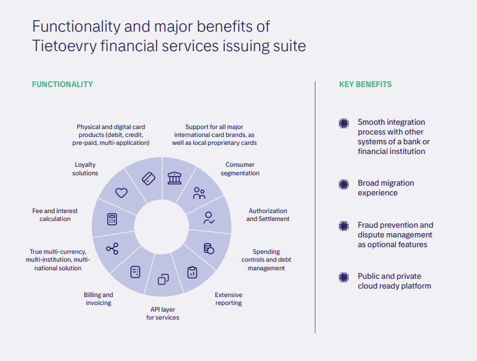

# Tietoevry Banking Card Service — Issuing Business Overview

Tietoevry provides a comprehensive card solution covering the full value chain — from card design and production to issuing, acquiring transaction processing, and merchant management. Its clients include banks, financial institutions, payment service providers (PSPs), payment processors, and fintech companies, primarily across the Nordic region and beyond.

---

## Issuer Software Platform

A future-proof, highly configurable payment issuing platform designed for fast time-to-market and seamless integration.

**Key characteristics:**

- Modular, real-time architecture with open APIs
- Flexible interest rate, fee calculation, and spending limit configuration
- Multi-level customer hierarchy support
- Supports bank cards, mobile wallets, credit, and deposit products
- Process automation reduces manual operations and operating costs

---

## Core Capabilities

### Card Management

- Issuance of physical and digital payment cards
- Card product setup and lifecycle management
- Cardholder data management and customer segmentation
- Authorization and settlement processing
- Billing, invoicing, and PIN management
- Advanced reporting engine
- GL export to bank accounting systems
- Multi-currency, multi-institution, multi-tenant architecture

### Card Tokenization

- Card schema tokenization supporting **Mastercard MDES**, **Visa VTS**, **Amex Tokenization Service**, **UnionPay PTS**, and **MIR**
- Enrollment into OEM wallets: Apple Pay, Google Pay, Samsung Pay, Fitbit Pay, Garmin Pay, Huawei Pay, and bank-proprietary Android wallets
- Full token lifecycle event management stored within the issuing solution, enabling self-service in cardholder-facing apps

### Commercial Cards

- Supports Business cards, Purchasing cards, Lodge cards, and Commercial cards — physical, virtual, or wallet-based
- Multi-level hierarchy replicating corporate structures, with hierarchical financial accounting and expense policy enforcement
- Customized reporting with ERP integration and data export to **MasterCard SmartData** and **Visa IntelliLink**

### Credit Cards

- Supports charge cards, revolving credit, BNPL, and installment plans, including Islamic finance-compliant products
- Flexible financial conditions: MTP calculation algorithms, grace periods, interest rates by spending group, transaction and lifecycle fee calculations
- Loyalty and cash-back engine: calculates and redeems bonus points based on cardholder spending habits, with targeted marketing capabilities

---

## Connectivity & Compliance

- International payment scheme connectivity (Visa, Mastercard, Amex, UnionPay, etc.) and domestic scheme support
- PSD2 compliant with Premium API support
- PA DSS certified
- Full compliance with industry security requirements

---

## Value-Added Services

| Service                    | Description                                                   |
| -------------------------- | ------------------------------------------------------------- |
| Instant Services           | Real-time card operations and notifications                   |
| Spending Controls          | Configurable limits per card, merchant category, or geography |
| Fraud & Dispute Management | Integrated fraud detection and chargeback handling            |
| Cardholder Loyalty         | Points, cash-back, and targeted marketing programs            |
| BNPL & Installments        | Out-of-box buy-now-pay-later and installment options          |
| Non-card Products          | Support for deposits and loans alongside card products        |
| Debtor Monitoring          | Tools for credit risk and collections management              |

---

## Benefits for Issuers

- **Reduced costs** through process automation and minimized manual operations
- **Faster time-to-market** via flexible system configuration and new business model creation
- **Scalability** — grow without adding resources, high performance architecture
- **Revenue growth** using advanced fee calculation and loyalty tools
- **Full control** with transparent business process management
- **Easy integration** via well-documented APIs for third-party systems

## Benefits for Cardholders

- All product types supported: prepaid, debit, credit, and commercial
- Physical and digital card options for diverse use cases
- Installment and BNPL functionality out of the box
- Full financial control via self-service features and real-time notifications
- Proprietary and OEM wallet support for broader payment flexibility

---

## Service Delivery Models

Tietoevry delivers its issuing platform under multiple models to fit different client needs:

- **SaaS (Software as a Service)** — cloud-hosted platform managed by Tietoevry
- **BPO (Business Process Outsourcing)** — end-to-end operational management on behalf of the issuer
- **On-premise / licensed software** — for institutions requiring in-house deployment
