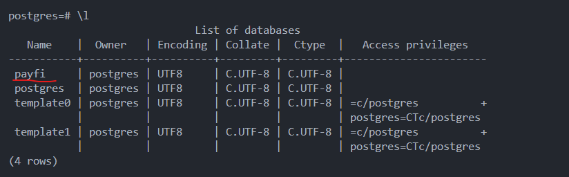
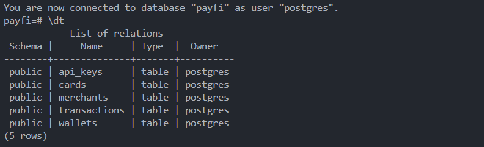
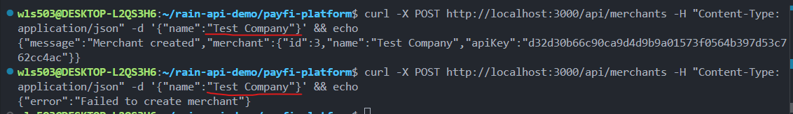

# Database Setup Guide (PostgreSQL)

This document describes the database layer used in the PayFi Platform project, why PostgreSQL was chosen, how to install it, common pitfalls encountered during setup, the required schema, and how to verify that the system is correctly deployed.

---

## Why PostgreSQL?

PayFi simulates a real-world fintech infrastructure (inspired by Rain, Stripe, Circle, etc.). For this reason, the database choice is not arbitrary.

From a **financial infrastructure perspective**, PostgreSQL is preferred because:

- **ACID compliance** – Guarantees correctness of balances and transactions
- **Strong transactional guarantees** – Critical for ledger systems
- **Row-level locking** – Prevents race conditions on balances
- **Rich constraint system** – Protects data integrity (foreign keys, uniqueness, etc.)
- **Widely used in fintech** – Common in payment companies, exchanges, and banks
- **Excellent tooling** – Debuggable via SQL, logs, CLI, and GUI tools

---

## Environment

This project is developed under:

- OS: Ubuntu 22.04
- Runtime: Node.js + TypeScript
- DB: PostgreSQL 14+
- Driver: `pg` (node-postgres)

---

## Installation

Run these commands inside your WSL Ubuntu terminal:

```bash
sudo apt update
sudo apt install postgresql postgresql-contrib
```

Start the service:

```bash
sudo service postgresql start
```

Switch to the postgres user:

```bash
sudo -u postgres psql
```

You should now see:

```
postgres=#
```

---

## Create Database

Inside psql:

```sql
CREATE DATABASE payfi;
```

Use the `\l` command to list all databases.

**Output:**



Connect to it:

```sql
\c payfi
```

---

## Set Database Password (Important)

PostgreSQL requires a string password when using SCRAM authentication.

Run inside psql:

```sql
ALTER USER postgres WITH PASSWORD 'postgres123';
```

Expected output:

```
ALTER ROLE
```

This password must match your `.env` file.

---

## Environment Variables (.env)

Create a file at project root:

```
.env
```

Example content:

```env
DB_HOST=localhost
DB_USER=postgres
DB_PASSWORD=postgres123
DB_NAME=payfi
DB_PORT=5432
```

The project uses `dotenv` to load this configuration.

---

## Required Tables

The project uses the following tables:

```sql
api_keys
cards
merchants
transactions
wallets
```

You can verify tables using:

```sql
\dt
```

**Output:**



These tables support:

- Merchant/Wallet/Cards API_Keys storage
- Card issuance simulation
- Merchants Onboarding with their KYC level
- Ledger-based accounting
- Wallets' balance

---

## Common Setup Issues & Fixes

### 1. Error: client password must be a string

Cause:

- DB_PASSWORD missing or undefined
- .env not loaded
- Password not configured in PostgreSQL

Fix:

- Ensure `.env` exists
- Ensure password is not empty
- Run:

```sql
ALTER USER postgres WITH PASSWORD 'postgres123';
```

---

### 2. dotenv module not found

Fix:

```bash
npm install dotenv
npm install --save-dev @types/dotenv
```

---

### 3. pg types not found

Fix:

```bash
npm install --save-dev @types/pg
```

---

### 4. Prevent merchants from registering duplicate names

Fix:

Use the following SQL statement before calling the merchant onboarding API.

```sql
ALTER TABLE merchants ADD CONSTRAINT unique_merchant_name UNIQUE(name);
SELECT setval('merchants_id_seq', (SELECT MAX(id) FROM merchants));
SELECT setval('api_keys_id_seq', (SELECT MAX(id) FROM api_keys));
```

Merchants with the same name will be rejected from joining.

**Output:**



---

### 5. Payment Processing - Transaction Type Constraint

**Background:**

With Phase 5 payment processing implementation, the system now supports direct payment transactions in addition to the initial transaction types (deposit, withdraw, transfer_in, transfer_out, card_spend).

**Issue:**

The database contains a strict constraint named `transactions_type_check` that restricts the `type` field in the transactions table to only five values: `deposit`, `withdraw`, `transfer_in`, `transfer_out`, and `card_spend`. When attempting to insert a `payment` transaction type, the database rejects the operation because `payment` is not in the allowed list, causing payment processing to fail.

**Fix:**

Run the following SQL statements to update the constraint and support the `payment` transaction type:

```sql
ALTER TABLE transactions DROP CONSTRAINT transactions_type_check;
ALTER TABLE transactions ADD CONSTRAINT transactions_type_check
CHECK (type = ANY (ARRAY['deposit'::text, 'withdraw'::text, 'transfer_in'::text, 'transfer_out'::text, 'card_spend'::text, 'payment'::text]));
```

These statements:

- Remove the old restrictive constraint
- Add a new constraint that includes `payment` as a valid transaction type

After running these commands, the payment processing functionality will operate correctly and accept payment transactions in the ledger system.

---

## How to Verify Deployment

Run the backend:

```bash
npm run dev
```

Expected output:

```
PayFi API running at http://localhost:3000
PostgreSQL connected successfully
```

This confirms:

- Environment loaded correctly
- PostgreSQL reachable
- Credentials valid
- DB connection pool healthy

- DB connection pool healthy
