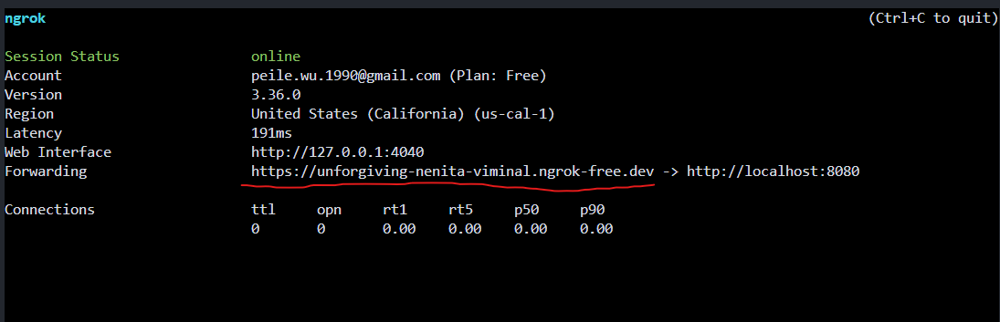
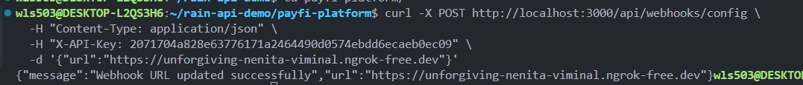
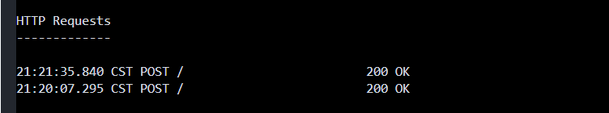
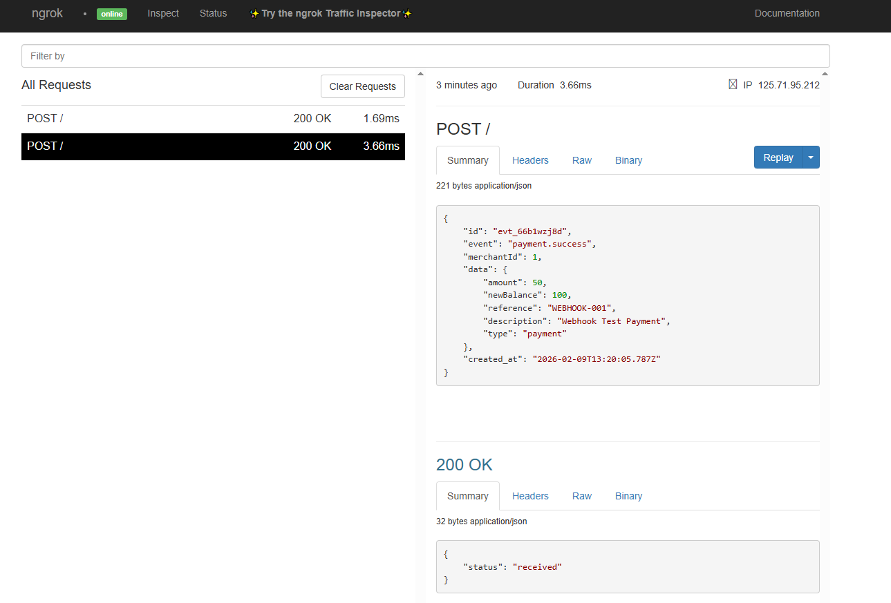
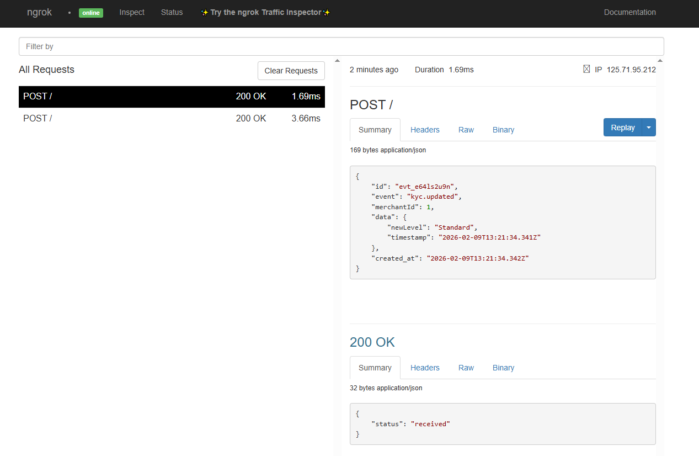

# Webhook Quick Start Guide

## What is Webhook?

A webhook is a real-time notification mechanism. When important events occur in the PayFi platform (such as payment completion, balance changes, KYC updates), the system proactively sends HTTP POST requests to the merchant's configured URL. Merchants no longer need to actively query for status updates.

---

## Part 1: Code Changes

### New Files

**1. `src/services/webhookService.ts`** - Core Service

- Defines `WebhookEvent` enumeration (payment.success, balance.updated, kyc.updated)
- Implements `triggerWebhook()` function to asynchronously send webhook notifications
- Uses axios to send HTTP POST requests

**2. `src/routes/webhooks.ts`** - API Routes

- `POST /api/webhooks/config` - Merchants configure webhook URL
- `GET /api/webhooks/config` - Retrieve configured webhook URL

### Updated Files

**1. `src/server.ts`**

- Import and register the new webhookRoutes

**2. `src/routes/payments.ts`**

- Call `triggerWebhook()` after successful payment to send `payment.success` event
- Send `balance.updated` event

**3. `src/routes/compliance.ts`**

- Call `triggerWebhook()` after KYC update to send `kyc.updated` event

---

## Part 2: Database Update

Add the webhook_url column to the PostgreSQL database:

```sql
ALTER TABLE merchants
ADD COLUMN IF NOT EXISTS webhook_url VARCHAR(255);
```

---

## Part 3: Deployment Steps

### 1. Update Code

Ensure all new and modified files are correctly placed in the project directory.

### 2. Install Dependencies

```bash
cd /home/ubuntu/rain-api-demo/payfi-platform

npm install axios
npm install --save-dev @types/axios
```

### 3. Update Database

Connect to the PostgreSQL database and execute the ALTER TABLE statement above.

### 4. Start the Service

```bash
cd /home/ubuntu/rain-api-demo/payfi-platform
npm run dev
```

You should see:

```
PayFi API running at http://localhost:3000
```

---

## Part 4: Local Testing with ngrok

### Why ngrok?

During local development, localhost:3000 is not accessible from the internet. ngrok creates a public tunnel that allows PayFi webhooks to reach your local webhook receiver.

### Step 1: Install ngrok

In WSL Ubuntu, execute:

```bash
# 1. Add ngrok's official GPG key
curl -s https://ngrok-agent.s3.amazonaws.com/ngrok.asc | sudo tee /etc/apt/trusted.gpg.d/ngrok.asc >/dev/null

# 2. Add ngrok's APT repository
echo "deb https://ngrok-agent.s3.amazonaws.com buster main" | sudo tee /etc/apt/sources.list.d/ngrok.list

# 3. Update and install ngrok
sudo apt update && sudo apt install ngrok
```

### Step 2: Get ngrok Authtoken

1. Visit [ngrok website](https://ngrok.com)
2. Sign in with GitHub or Google account
3. Find **Your Authtoken** in the dashboard and copy it
4. In terminal, run (replace YOUR_AUTHTOKEN):

```bash
ngrok config add-authtoken YOUR_AUTHTOKEN
```

### Step 3: Start ngrok Tunnel

```bash
ngrok http 8080
```

Output screen:



**Key Information**: The URL shown in `Forwarding` (e.g., `https://abc123.ngrok-free.dev`) is your public webhook URL.

### Step 4: Create Webhook Receiver

Create file `receiver.js`:

```javascript
const http = require("http");

const server = http.createServer((req, res) => {
    if (req.method === "POST") {
        let body = "";

        req.on("data", (chunk) => {
            body += chunk.toString();
        });

        req.on("end", () => {
            console.log("Received Webhook:", JSON.parse(body));
            res.writeHead(200, { "Content-Type": "application/json" });
            res.end(JSON.stringify({ status: "received" }));
        });
    } else {
        res.writeHead(200, { "Content-Type": "text/plain" });
        res.end("Webhook receiver running");
    }
});

server.listen(8080, () => {
    console.log("Webhook receiver listening on port 8080");
});
```

Start the receiver:

```bash
node receiver.js
```

### Step 5: Configure Merchant Webhook URL

```bash
curl -X POST http://localhost:3000/api/webhooks/config \
  -H "Content-Type: application/json" \
  -H "X-API-Key: 2071704a828e63776171a2464490d0574ebdd6ecaeb0ec09" \
  -d '{"url":"https://your-ngrok-url.ngrok-free.dev/webhook"}'
```

**Note**: Replace `https://your-ngrok-url.ngrok-free.dev` with your actual ngrok URL.

Successful configuration response:



---

## Part 5: Trigger Webhook Events

### Event 1: Trigger payment.success (Payment Completed)

```bash
curl -X POST http://localhost:3000/api/payments/pay \
  -H "Content-Type: application/json" \
  -H "X-API-Key: 2071704a828e63776171a2464490d0574ebdd6ecaeb0ec09" \
  -d '{
    "toMerchantId": 2,
    "amount": 50,
    "description": "Webhook Test Payment",
    "reference": "WEBHOOK-001"
  }'
```

**Expected Response**:

```json
{
    "message": "Payment successful",
    "transaction": {
        "merchantId": 1,
        "amount": 50,
        "newBalance": 100,
        "reference": "WEBHOOK-001"
    }
}
```

Your webhook receiver will output:

```
Received Webhook: {
  event: 'payment.success',
  merchantId: 2,
  amount: 50,
  newBalance: 100,
  reference: 'WEBHOOK-001',
  timestamp: '2025-02-09T10:30:00Z'
}
```

### Event 2: Trigger kyc.updated (KYC Update)

```bash
curl -X POST http://localhost:3000/api/compliance/set-kyc \
  -H "X-API-Key: 2071704a828e63776171a2464490d0574ebdd6ecaeb0ec09" \
  -H "Content-Type: application/json" \
  -d '{"level":"Standard"}'
```

Your webhook receiver will output:

```
Received Webhook: {
  event: 'kyc.updated',
  merchantId: 1,
  level: 'Standard',
  previousLevel: 'Basic',
  timestamp: '2025-02-09T10:35:00Z'
}
```

---

## Part 6: Verify Webhook Delivery

### Check Terminal Output

Your webhook receiver terminal will print received events:



### Check ngrok Dashboard

ngrok provides a web interface (usually `http://localhost:4040`) to view all webhook requests:





In the dashboard, you can see:

- Each HTTP POST request
- Request headers and body
- Response status codes
- Complete event data

---

## Summary

### Complete Workflow

1. ✅ Start PayFi API: `npm run dev`
2. ✅ Start ngrok tunnel: `ngrok http 8080`
3. ✅ Start webhook receiver: `node receiver.js`
4. ✅ Configure webhook URL: `POST /api/webhooks/config`
5. ✅ Trigger payment or KYC event
6. ✅ View webhook in receiver/ngrok dashboard

### Three Event Types

| Event             | Trigger           | Includes                                   |
| ----------------- | ----------------- | ------------------------------------------ |
| `payment.success` | Payment completed | Amount, new balance, transaction reference |
| `balance.updated` | Balance changed   | Previous and new balance, change amount    |
| `kyc.updated`     | KYC level changed | KYC level, previous and new level          |

### Common Questions

**Q: Why didn't my webhook get received?**  
A: Make sure your webhook receiver is running, ngrok URL is correctly configured, and firewall is not blocking.

**Q: How do I confirm webhook was sent?**  
A: Check ngrok dashboard or receiver terminal output.

**Q: How to configure for production?**  
A: Replace ngrok URL with your real HTTPS URL and configure your production webhook endpoint.

---

**You're ready to test webhook functionality now!** 🚀
