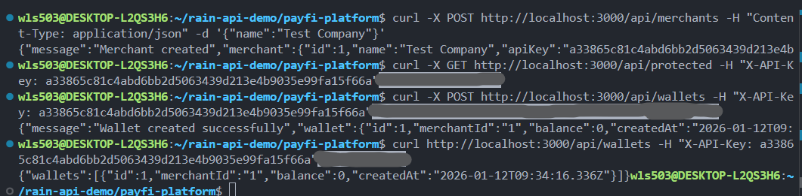
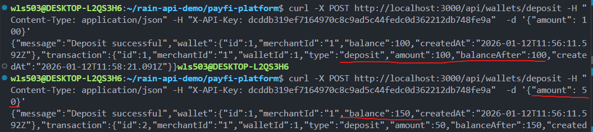
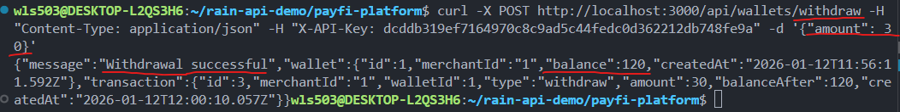
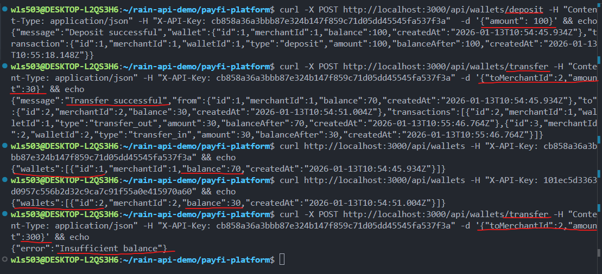
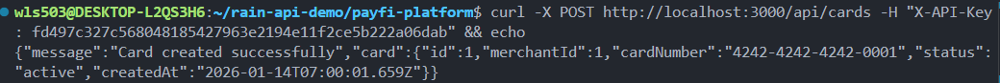
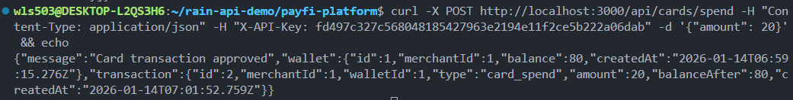
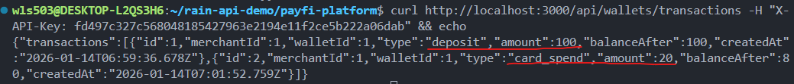
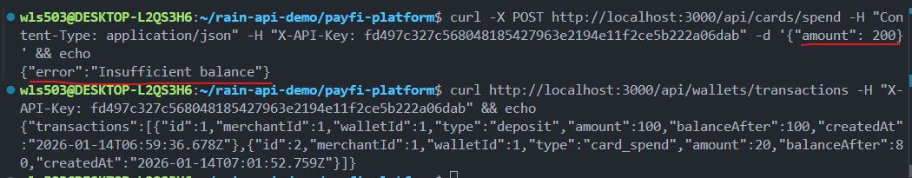
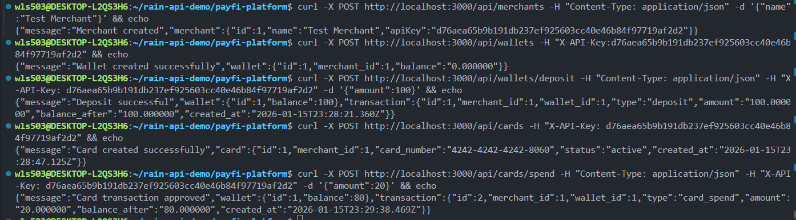
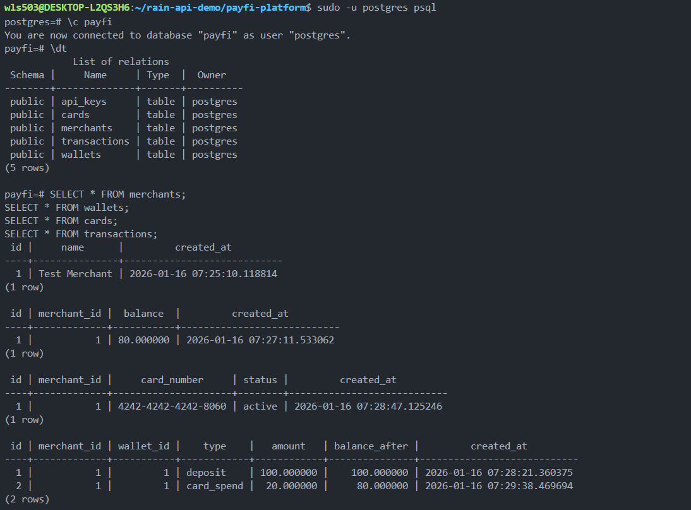

# PayFi Platform - Technical Documentation

## Overview

This is a personal learning project to understand Rain's payment infrastructure architecture, specifically their merchant integration, wallet management, fiat-to-stablecoin flows, card issuing, and webhook systems. Built as a reference implementation for studying fintech infrastructure patterns.

---

# Phase 1: Merchant Integration (Merchant Onboarding)

## Why Create Merchants?

For a payment platform to function, external businesses need a way to join and access APIs. A merchant is simply a registered business that can make authenticated requests to the platform.

Without merchant registration, there's no entry point for businesses to use the payment infrastructure.

## Implementation: Merchant Registration

Create file structure:

```
mkdir src/routes
touch src/routes/merchants.ts
```

This file handles the merchant registration endpoint. When a business signs up, the system generates their API Key and stores their account.

**Test the endpoint:**

```bash
curl -X POST http://localhost:3000/api/merchants \
  -H "Content-Type: application/json" \
  -d '{"name":"Test Company"}'
```

**Success:** You receive a response with the merchant's generated API Key.

---

## Why API Key Authentication?

Once merchants register, the platform must verify every request actually comes from that merchant. An API Key acts as credentials—like a username/password, but for automated systems.

Without authentication, anyone could pretend to be a merchant and access their wallets or issue cards on their behalf.

## Implementation: Authentication Middleware

Create file:

```
mkdir src/middleware
touch src/middleware/auth.ts
```

This file contains two functions:

-   `registerApiKey()`: Stores a newly generated API Key when a merchant signs up
-   `apiKeyAuth()`: Middleware that checks if incoming requests have a valid API Key

Update `src/server.ts` to import the authentication middleware and create a protected test endpoint.

**Test authentication using the API Key from merchant registration:**

```bash
curl -X GET http://localhost:3000/api/protected \
  -H "X-API-Key: YOUR_API_KEY_HERE"
```

Replace `YOUR_API_KEY_HERE` with the actual API Key you received from the merchant registration response.

**Example:**

Success: You see the message "You have access to protected resource"

**Failure (without API Key or with invalid key):** You get a 401 or 403 error.

---

## What This Enables

-   Merchants can only access resources they own
-   All future features (wallets, cards, payments) can assume requests are from authenticated merchants
-   The platform has a security foundation for all protected endpoints

---

# Phase 2: Wallet System

## Why Wallet Management?

Once merchants are authenticated, the platform needs a place to store their funds. A wallet is a merchant's account balance on the platform—it tracks how much money they have available.

Without wallets:

-   All merchants' funds would mix together (no separation)
-   You couldn't validate if a merchant has enough balance before processing payments
-   There's no audit trail of who owns what

Wallets are the foundation for all financial operations: deposits, withdrawals, card issuance, and payments.

## Implementation: Create Merchant Wallet

Create file:

```
mkdir src/routes
touch src/routes/wallets.ts
```

This file handles wallet operations. When a merchant is created, they automatically get a wallet. The wallet stores their USDC balance (simulated stablecoin).

Key changes to existing code:

-   `auth.ts`: API Key registry now tracks `API Key → Merchant ID` mapping, so wallets know who owns them
-   `merchants.ts`: When registering API Key, we now pass the merchant ID for ownership tracking
-   `server.ts`: Import and register the new wallet routes

**Create merchant and view wallet:**

When a merchant signs up, they automatically receive a wallet with 0 USDC balance. View it using their API Key:

```bash
curl -X GET http://localhost:3000/api/wallets \
  -H "X-API-Key: YOUR_API_KEY_HERE"
```

**Example:**



Success: You see wallet ID, merchant ID, currency (USDC), and balance (0).

---

## Why Wallet Ledger and Fund Movement?

A wallet without the ability to move funds is just a static number. Real payment platforms need merchants to deposit funds, withdraw funds, and track every transaction. This creates an audit trail and prevents fraud.

This stage introduces a basic ledger system. Merchants can now:

-   Top up wallet balance (deposits)
-   Spend from wallet balance (withdrawals)
-   Transfer funds to other merchants
-   View full transaction history
-   Automatic balance validation to prevent overspending

Every balance change is recorded as a transaction for auditability—this is how real financial systems track money movement.

## Implementation: Deposit, Withdraw, Transfer, Transactions

The wallet routes now include four new endpoints:

**Deposit funds into wallet:**

```bash
curl -X POST http://localhost:3000/api/wallets/deposit \
  -H "Content-Type: application/json" \
  -H "X-API-Key: YOUR_API_KEY" \
  -d '{"amount": 100}'
```

**Example:**



Success: Wallet balance increases, transaction recorded.

---

**Withdraw funds from wallet:**

```bash
curl -X POST http://localhost:3000/api/wallets/withdraw \
  -H "Content-Type: application/json" \
  -H "X-API-Key: YOUR_API_KEY" \
  -d '{"amount": 30}'
```

**Example:**



Success: Wallet balance decreases, transaction recorded.

---

**Transfer funds to another merchant:**

```bash
curl -X POST http://localhost:3000/api/wallets/transfer \
  -H "Content-Type: application/json" \
  -H "X-API-Key: MERCHANT_1_API_KEY" \
  -d '{"toMerchantId": 2, "amount": 30}'
```

**Example:**



Success: Merchant 1 transfers 30 to Merchant 2. Merchant 1 wallet drops from 100 to 70, Merchant 2 wallet increases to 30. Both transactions recorded in ledger.

---

**View transaction history (ledger):**

```bash
curl http://localhost:3000/api/wallets/transactions \
  -H "X-API-Key: YOUR_API_KEY"
```

Returns all deposits, withdrawals, and transfers for the merchant.

---

**Balance validation in action (insufficient funds):**

Try transferring more than available balance:

```bash
curl -X POST http://localhost:3000/api/wallets/transfer \
  -H "Content-Type: application/json" \
  -H "X-API-Key: MERCHANT_1_API_KEY" \
  -d '{"toMerchantId": 2, "amount": 300}'
```

Error: Transfer blocked. Merchant 1 only has 70 remaining, cannot transfer 300.

---

## What This Enables

-   Merchants can fund their wallets (top-up mechanism)
-   Merchants can spend from wallets (payment settlement)
-   Merchants can transfer funds to other merchants
-   Complete audit trail of all transactions
-   Risk management via balance validation
-   Foundation for card issuance and payment processing

---

# Phase 3: Card Issuing

## Why Virtual Cards?

A wallet alone stores funds but doesn't provide a mechanism for merchants to spend. Virtual cards represent a practical way for merchants to use their wallet balance in real-world transactions. Each card is tied to a merchant's wallet and can spend against that balance.

Without card issuing:

-   Merchants can't spend their wallet funds
-   No way to track individual card transactions
-   No spending controls or balance enforcement at the card level

## Implementation: Card Creation and Management

Create file:

```
touch src/routes/cards.ts
```

This file handles card operations. When a merchant creates a card, the system generates a virtual card linked to their wallet. The card can spend against the merchant's available balance.

Update `src/server.ts` to import and register card routes.

**Create a virtual card:**

```bash
curl -X POST http://localhost:3000/api/cards \
  -H "X-API-Key: YOUR_API_KEY"
```

**Example:**



Success: Card is created and linked to the merchant's wallet. You receive a card ID and card number.

---

**View all cards for a merchant:**

```bash
curl http://localhost:3000/api/cards \
  -H "X-API-Key: YOUR_API_KEY"
```

Returns all active cards belonging to the authenticated merchant.

---

## Why Card Spending?

A card without spending capability is useless. The spending endpoint simulates real-world card transactions by deducting funds from the merchant's wallet. Each spend is recorded in the transaction ledger to maintain a complete audit trail.

## Implementation: Card Spending Against Wallet Balance

The card spending endpoint deducts funds from the merchant's wallet and validates that sufficient balance exists before processing the transaction.

**Simulate card spending:**

```bash
curl -X POST http://localhost:3000/api/cards/spend \
  -H "Content-Type: application/json" \
  -H "X-API-Key: YOUR_API_KEY" \
  -d '{"amount": 20}'
```

**Example:**



Success: Wallet balance drops from 100 to 80. Transaction recorded in ledger.

---

**Example Scenario:**

Assume you've already:

1. Created a merchant (with API Key)
2. Deposited 100 USDC to the wallet
3. Created a virtual card

Now spend 20:

```bash
curl -X POST http://localhost:3000/api/cards/spend \
  -H "Content-Type: application/json" \
  -H "X-API-Key: YOUR_API_KEY" \
  -d '{"amount": 20}'
```

Success: Wallet balance drops from 100 to 80. Transaction recorded in ledger.

---

**Check wallet transactions:**

```bash
curl http://localhost:3000/api/wallets/transactions \
  -H "X-API-Key: YOUR_API_KEY"
```

**Example:**



You see two transactions:

1. Deposit: +100 USDC
2. Card Spend: -20 USDC
3. Remaining balance: 80 USDC

---

**Insufficient funds prevention:**

Try spending more than available balance:

```bash
curl -X POST http://localhost:3000/api/cards/spend \
  -H "Content-Type: application/json" \
  -H "X-API-Key: YOUR_API_KEY" \
  -d '{"amount": 200}'
```

**Example:**



Error: Transaction rejected. Merchant only has 80 USDC available, cannot spend 200.

The transaction count remains unchanged—the failed transaction is not recorded.

---

## What This Enables

-   Merchants can issue virtual cards tied to their wallets
-   Real-time balance deductions when cards are used
-   Complete transaction audit trail for card spending
-   Automatic fraud prevention via balance validation
-   Foundation for advanced features like spending limits and transaction webhooks

---

# Database Persistence

## Migration from In-Memory to PostgreSQL

Previously, all merchant data was stored in memory using JavaScript Maps and objects:

-   `apiKeyRegistry`: In-memory `Map<string, number>` storing API Key → Merchant ID mappings
-   `merchantDb`: In-memory object storing merchant records
-   `walletDb`: In-memory object storing wallet balances
-   `cardDb`: In-memory object storing card records
-   `transactionLedger`: In-memory array storing all transactions

This approach was sufficient for learning but lacked persistence. When the server restarted, all data was lost.

## Implementation: PostgreSQL Storage

We've migrated to PostgreSQL to provide persistent, reliable storage for all platform data. The routes have been refactored to replace in-memory storage with database queries. Key changes:

-   **api_keys table**: Stores API Key hashes linked to merchants via foreign key
-   **merchants table**: Persistent merchant registration data
-   **wallets table**: Merchant balance storage with atomic updates
-   **transactions table**: Complete audit trail of all balance movements and card spending
-   **cards table**: Virtual card records linked to merchant wallets

The authentication middleware (`auth.ts`) now validates API Keys by querying the PostgreSQL `api_keys` table instead of checking an in-memory Map.

All wallet operations (deposit, withdraw, transfer, card spend) now:

1. Read current balance from the `wallets` table
2. Validate sufficient funds
3. Execute atomic database transactions to update balance and record the movement in the `transactions` table

### End-to-End Flow: From API Request to Database Verification

**Step 1: Execute complete API operation chain**



This demonstrates a full workflow executing multiple operations in sequence:

-   Create merchant and receive API Key
-   Create wallet for the merchant
-   Deposit 100 USDC to wallet
-   Create virtual card
-   Spend 20 USDC via card

All operations return success responses with updated balances and transaction details.

---

**Step 2: Query PostgreSQL to verify data persistence**



Running SQL queries against the persistent database reveals:

**merchants table**: One Test Merchant created at 2026-01-16 07:25:10 (1 row)

**wallets table**: Wallet ID 1 for merchant 1 with balance 80.000000 (result of 100 deposited - 20 spent via card)

**cards table**: Card 4242-4242-4242-8060 issued to merchant 1 with active status (1 row)

**transactions table**:

-   Row 1: Deposit transaction, +100 USDC, balance after 100
-   Row 2: Card spend transaction, -20 USDC, balance after 80

(2 rows total)

All data is atomically persisted with timestamps and complete audit trail. This demonstrates how the refactored routes successfully replaced in-memory operations with reliable database persistence.

---

## Core Tables Overview

| Table            | Purpose                                                                                                |
| ---------------- | ------------------------------------------------------------------------------------------------------ |
| **merchants**    | Registered businesses with name, email, created timestamp                                              |
| **api_keys**     | Authentication credentials linking API keys to merchants                                               |
| **wallets**      | Merchant balance ledgers storing currency and balance (NUMERIC type for precision)                     |
| **transactions** | Complete audit trail: type (deposit/withdraw/transfer/card_spend), amount, sender, receiver, timestamp |
| **cards**        | Virtual cards linking to merchant wallets with card numbers and status                                 |

For detailed setup instructions, database installation, schema DDL, and PostgreSQL connection configuration, see **[PostgreSQL_Setup](./PostgreSQL_setup_guide.md)**

---

## What This Enables

-   **Data Persistence**: All merchant data survives server restarts
-   **Audit Trail**: Complete PostgreSQL transaction history for compliance and debugging
-   **Scalability**: Database queries are more efficient than in-memory lookups at scale
-   **Reliability**: PostgreSQL's ACID compliance ensures financial data consistency
-   **Multi-Instance**: Multiple server instances can share the same database for horizontal scaling
