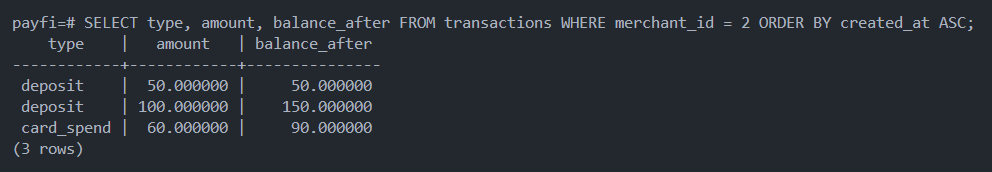
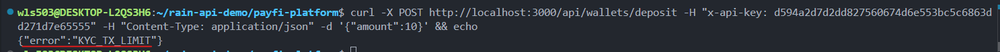
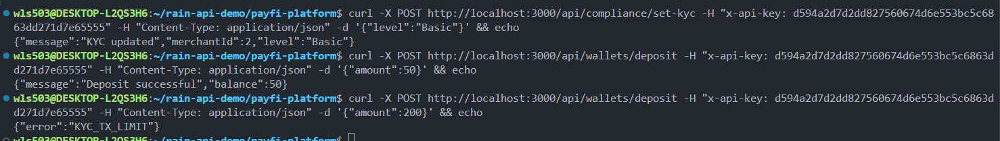
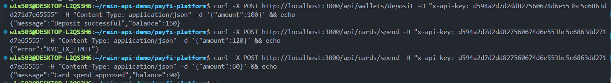
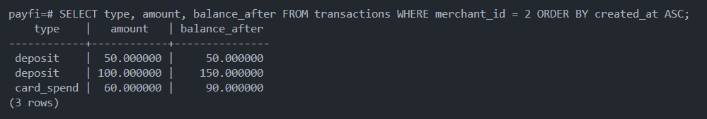
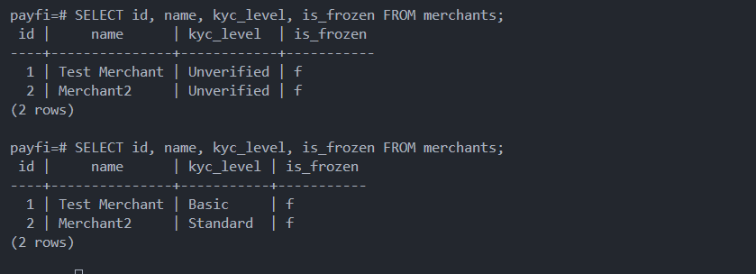
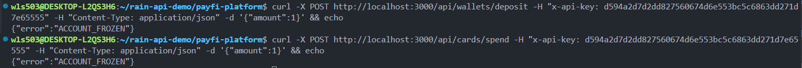

# PayFi Platform - Technical Documentation

## Overview

This is a personal project built upon an understanding of Rain's payment infrastructure architecture, particularly its modules for merchant integration, wallet management, card issuance, and webhook systems. It aims to serve as a reference implementation simulating a fintech infrastructure model.

---

# Phase 1: Merchant Integration (Merchant Onboarding)

## Why Create Merchants?

A payment platform only works if other companies can connect to it and use its APIs.
A merchant is simply a company that signs up on your platform and gets permission (API keys) to call your APIs.

Merchants use your APIs to:

- create wallets

- accept payments

- send payouts

- check balances and transaction history

## Implementation: Merchant Registration

Create file structure:

```
mkdir src/routes
touch src/routes/merchants.ts
```

This file handles the merchant registration endpoint. When a business signs up, the system generates their API Key and stores their account.

**Test the endpoint:**

```bash
curl -X POST http://localhost:3000/api/merchants \
  -H "Content-Type: application/json" \
  -d '{"name":"Test Company"}'
```

**Success:** You receive a response with the merchant's generated API Key.

**Output:**


---

## Why API Key Authentication?

Once merchants register, the platform must verify every request actually comes from that merchant. An API Key acts as credentialsâ€"like a username/password, but for automated systems.

Without authentication, anyone could pretend to be a merchant and access their wallets or issue cards on their behalf.

## Implementation: Authentication Middleware

Create file:

```
mkdir src/middleware
touch src/middleware/auth.ts
```

This file contains two functions:

- `registerApiKey()`: Stores a newly generated API Key when a merchant signs up
- `apiKeyAuth()`: Middleware that checks if incoming requests have a valid API Key

Update `src/server.ts` to import the authentication middleware and create a protected test endpoint.

**Test authentication using the API Key from merchant registration:**

```bash
curl -X GET http://localhost:3000/api/protected \
  -H "X-API-Key: YOUR_API_KEY"
```

Replace `YOUR_API_KEY` with the actual API Key you received from the merchant registration response.

**Example:**

Success: You see the message "You have access to protected resource"

**Failure (without API Key or with invalid key):** You get a 401 or 403 error.

---

## What This Enables

- Merchants can only access resources they own
- All future features (wallets, cards, payments) can assume requests are from authenticated merchants
- The platform has a security foundation for all protected endpoints

---

# Phase 2: Wallet System

## Why Wallet Management?

Once merchants are authenticated, the platform needs a place to store their funds. A wallet is a merchant's account balance on the platform, which tracks how much money they have available.

Without wallets:

- All merchants' funds would mix together (no separation)
- You couldn't validate if a merchant has enough balance before processing payments
- There's no audit trail of who owns what

Wallets are the foundation for all financial operations: deposits, withdrawals, card issuance, and payments.

## Implementation: Create Merchant Wallet

Create file:

```
mkdir src/routes
touch src/routes/wallets.ts
```

This file handles wallet operations. When a merchant is created, they automatically get a wallet. The wallet stores their funds balance.

**Create merchant and view wallet:**

When a merchant signs up, they automatically receive a wallet with 0 fund balance. View it using their API Key:

```bash
curl -X POST http://localhost:3000/api/wallets \
  -H "X-API-Key: YOUR_API_KEY"
```

**Example:**

Success: You see wallet ID, merchant ID, currency fund, and balance (0).

**Output:**


---

## Why Wallet Ledger and Fund Movement?

A wallet without the ability to move funds is just a static number. Real payment platforms need merchants to deposit funds, withdraw funds, and track every transaction. This creates an audit trail and prevents fraud.

This stage introduces a basic ledger system. Merchants can now:

- Top up wallet balance (deposits)
- Spend from wallet balance (withdrawals)
- Transfer funds to other merchants
- View full transaction history
- Automatic balance validation to prevent overspending

Every balance change is recorded as a transaction for auditabilityâ€"this is how real financial systems track money movement.

## Implementation: Deposit, Withdraw, Transfer, Transactions

The wallet routes now include four new endpoints:

**Deposit funds into wallet:**

```bash
curl -X POST http://localhost:3000/api/wallets/deposit \
  -H "Content-Type: application/json" \
  -H "X-API-Key: YOUR_API_KEY" \
  -d '{"amount": 100}'
```

**Example:**

Success: Wallet balance increases, transaction recorded.

---

**Withdraw funds from wallet:**

```bash
curl -X POST http://localhost:3000/api/wallets/withdraw \
  -H "Content-Type: application/json" \
  -H "X-API-Key: YOUR_API_KEY" \
  -d '{"amount": 30}'
```

**Example:**

Success: Wallet balance decreases, transaction recorded.

---

## What This Enables

- Merchants can fund their wallets (top-up mechanism)
- Merchants can spend from wallets (payment settlement)
- Complete audit trail of all transactions
- Risk management via balance validation
- Foundation for card issuance and payment processing

---

# Phase 3: Card Issuing

## Why Virtual Cards?

A wallet alone stores funds but doesn't provide a mechanism for merchants to spend. Virtual cards represent a practical way for merchants to use their wallet balance in real-world transactions. Each card is tied to a merchant's wallet and can spend against that balance.

Without card issuing:

- Merchants can't spend their wallet funds
- No way to track individual card transactions
- No spending controls or balance enforcement at the card level

## Implementation: Card Creation and Management

Create file:

```
touch src/routes/cards.ts
```

This file handles card operations. When a merchant creates a card, the system generates a virtual card linked to their wallet. The card can spend against the merchant's available balance.

Update `src/server.ts` to import and register card routes.

**Create a virtual card:**

```bash
curl -X POST http://localhost:3000/api/cards \
  -H "X-API-Key: YOUR_API_KEY"
```

**Example:**

Success: Card is created and linked to the merchant's wallet. You receive a card ID and card number.

---

**View all cards for a merchant:**

```bash
curl http://localhost:3000/api/cards \
  -H "X-API-Key: YOUR_API_KEY"
```

Returns all active cards belonging to the authenticated merchant.

---

## Why Card Spending?

A card without spending capability is useless. The spending endpoint simulates real-world card transactions by deducting funds from the merchant's wallet. Each spend is recorded in the transaction ledger to maintain a complete audit trail.

## Implementation: Card Spending Against Wallet Balance

The card spending endpoint deducts funds from the merchant's wallet and validates that sufficient balance exists before processing the transaction.

**Simulate card spending:**

```bash
curl -X POST http://localhost:3000/api/cards/spend \
  -H "Content-Type: application/json" \
  -H "X-API-Key: YOUR_API_KEY" \
  -d '{"amount": 20}'
```

**Example Scenario:**

Assume you've already created a merchant, deposited 100 funds, and created a virtual card. Now spend 20:

Success: Wallet balance drops from 100 to 80. Transaction recorded in ledger.

---

**Check wallet transactions:**

Query database to verify all card operations:

```sql
SELECT type, amount, balance_after FROM transactions WHERE merchant_id = 2 ORDER BY created_at ASC;
```

**Example Output:**



---

**Insufficient funds prevention:**

Try spending more than available balance:

```bash
curl -X POST http://localhost:3000/api/cards/spend \
  -H "Content-Type: application/json" \
  -H "X-API-Key: YOUR_API_KEY" \
  -d '{"amount": 200}'
```

Error: Transaction rejected. Merchant only has available balance, cannot spend 200.

The transaction is not recordedâ€"the failed transaction is not persisted.

---

## What This Enables

- Merchants can issue virtual cards tied to their wallets
- Real-time balance deductions when cards are used
- Complete transaction audit trail for card spending
- Automatic fraud prevention via balance validation
- Foundation for advanced features like spending limits and transaction webhooks

---

# Phase 4: KYC Compliance & Risk Engine

## Why KYC Controls?

A fintech platform without compliance controls is a money laundering risk. KYC (Know Your Customer) verification determines transaction limitsâ€"merchants with higher verification levels can transact larger amounts.

Without KYC controls:

- Unverified merchants could move unlimited funds
- Risk of facilitating illegal transactions
- No regulatory compliance
- Platform exposure to financial crimes

KYC enforcement is implemented in the risk engine, which evaluates every transaction against the merchant's verification level.

## Implementation: KYC Levels & Limits

Create compliance files:

```
touch src/compliance/kycLevels.ts
touch src/compliance/riskEngine.ts
touch src/routes/compliance.ts
```

**KYC Levels:**

| Level      | Max Single Tx | Max Balance | Use Case                |
| ---------- | ------------- | ----------- | ----------------------- |
| Unverified | 0             | 0           | No transactions allowed |
| Basic      | 100           | 500         | Retail customers        |
| Standard   | 1000          | 5000        | Normal merchants        |
| Business   | 10000         | 50000       | Business entities       |
| VIP        | 100000        | 500000      | Premium partners        |

## Testing: KYC Enforcement

**Verify setup:**

Register compliance routes in `server.ts`:

```typescript
import complianceRoutes from "./routes/compliance";
app.use("/api", complianceRoutes);
```

---

**Step 1: Attempt transaction with Unverified status (should fail)**

```bash
curl -X POST http://localhost:3000/api/wallets/deposit \
  -H "x-api-key: YOUR_API_KEY" \
  -H "Content-Type: application/json" \
  -d '{"amount":10}'
```

**Response:**

```json
{
    "error": "KYC_TX_LIMIT"
}
```

**Reason:** Merchant defaulting to Unverified level (maxTx=0). Any positive amount exceeds limit.



---

**Step 2: Upgrade KYC to Basic**

```bash
curl -X POST http://localhost:3000/api/compliance/set-kyc \
  -H "x-api-key: YOUR_API_KEY" \
  -H "Content-Type: application/json" \
  -d '{"level":"Basic"}'
```

**Response:**

```json
{
    "message": "KYC updated",
    "merchantId": 2,
    "level": "Basic"
}
```

---

**Step 3: Deposit 50 within Basic limit (should succeed)**

```bash
curl -X POST http://localhost:3000/api/wallets/deposit \
  -H "x-api-key: YOUR_API_KEY" \
  -H "Content-Type: application/json" \
  -d '{"amount":50}'
```

**Response:**

```json
{
    "message": "Deposit successful",
    "balance": 50
}
```

---

**Step 4: Attempt deposit of 200 exceeding Basic limit (should fail)**

```bash
curl -X POST http://localhost:3000/api/wallets/deposit \
  -H "x-api-key: YOUR_API_KEY" \
  -H "Content-Type: application/json" \
  -d '{"amount":200}'
```

**Response:**

```json
{
    "error": "KYC_TX_LIMIT"
}
```

**Reason:** Basic level maxTx=100. Request of 200 exceeds limit.

Wallet balance remains 50 (transaction not recorded).



---

**Step 5: Deposit 100 within Basic limit (should succeed)**

```bash
curl -X POST http://localhost:3000/api/wallets/deposit \
  -H "x-api-key: YOUR_API_KEY" \
  -H "Content-Type: application/json" \
  -d '{"amount":100}'
```

**Response:**

```json
{
    "message": "Deposit successful",
    "balance": 150
}
```

Wallet now has 50 + 100 = 150.

---

**Step 6: Attempt card spend of 120 exceeding Basic limit (should fail)**

```bash
curl -X POST http://localhost:3000/api/cards/spend \
  -H "x-api-key: YOUR_API_KEY" \
  -H "Content-Type: application/json" \
  -d '{"amount":120}'
```

**Response:**

```json
{
    "error": "KYC_TX_LIMIT"
}
```

**Reason:** Basic level maxTx=100. Card spend of 120 exceeds limit even though wallet has 150 balance.

---

**Step 7: Card spend of 60 within Basic limit (should succeed)**

```bash
curl -X POST http://localhost:3000/api/cards/spend \
  -H "x-api-key: YOUR_API_KEY" \
  -H "Content-Type: application/json" \
  -d '{"amount":60}'
```

**Response:**

```json
{
    "message": "Card spend approved",
    "balance": 90
}
```

Wallet balance: 150 - 60 = 90.

**Output:**



---

**Step 8: Verify transaction ledger**

```sql
SELECT type, amount, balance_after FROM transactions WHERE merchant_id = 2 ORDER BY created_at ASC;
```

**Output:**



---

## Account Freezing: Immediate Transaction Block

Beyond KYC limits, the platform can freeze high-risk merchant accounts, completely blocking all transactions. This is the final layer of compliance control.

**Why Freeze Accounts?**

- Suspicious activity patterns detected
- Regulatory compliance requirements
- Account takeover prevention
- Immediate risk containment

The frozen status is stored in the `merchants` table. When `is_frozen = true`, all deposits, withdrawals, and card spending are rejected before KYC checks are performed.

**Testing Account Freezing:**

**Setup: Set different KYC levels for merchants**

Give Merchant 1 Basic level, Merchant 2 Standard level:

```bash
curl -X POST http://localhost:3000/api/compliance/set-kyc \
  -H "x-api-key: d76aea65b9b191db237ef925603cc40e46b84f97719af2d2" \
  -H "Content-Type: application/json" \
  -d '{"level":"Basic"}'

curl -X POST http://localhost:3000/api/compliance/set-kyc \
  -H "x-api-key: d594a2d7d2dd827560674d6e553bc5c6863dd271d7e65555" \
  -H "Content-Type: application/json" \
  -d '{"level":"Standard"}'
```

**Verify in database:**

```sql
SELECT id, name, kyc_level, is_frozen FROM merchants;
```



---

**Freeze Merchant 2:**

```sql
UPDATE merchants SET is_frozen = true WHERE id = 2;
```

---

**Attempt deposit (should fail - frozen):**

```bash
curl -X POST http://localhost:3000/api/wallets/deposit \
  -H "x-api-key: d594a2d7d2dd827560674d6e553bc5c6863dd271d7e65555" \
  -H "Content-Type: application/json" \
  -d '{"amount":1}'
```

**Response:**

```json
{
    "error": "ACCOUNT_FROZEN"
}
```

---

**Attempt card spend (should fail - frozen):**

```bash
curl -X POST http://localhost:3000/api/cards/spend \
  -H "x-api-key: d594a2d7d2dd827560674d6e553bc5c6863dd271d7e65555" \
  -H "Content-Type: application/json" \
  -d '{"amount":1}'
```

**Response:**

```json
{
    "error": "ACCOUNT_FROZEN"
}
```



A frozen account cannot deposit or spend, providing complete transaction lockdown.

---

## Architecture: How Compliance Flows Work

```
Request Flow:
┌─────────────────────────────────┐
│ POST /api/wallets/deposit       │
│ POST /api/cards/spend           │
│ POST /api/wallets/withdraw      │
└────────────┬────────────────────┘
             │
    ┌────────v──────────────────────────────┐
    │ complianceCheck()                     │
    │ 1. Check if frozen (first!)           │
    │ 2. Get merchant KYC level             │
    │ 3. Evaluate transaction against limit │
    └──┬─────────────────┬────────────┬─────┘
       │                 │            │
    FROZEN           FAIL KYCK      PASS
    (REJECT)         LIMIT (REJECT)   │
    ACCOUNT_         KYC_TX_          │
    FROZEN           LIMIT      ┌─────v────┐
                                │PROCESS TX│
                                └──────────┘
```

---

## Architecture: How KYC Flows Work

```
Request Flow:
┌──────────────────────────────────────┐
│ POST /api/cards                      │
│ POST /api/wallets                    │
└──────────────────┬───────────────────┘
                   │
    ┌──────────────v────────────────────────┐
    │ complianceCheck()                     │
    │ 1. Check if merchant is frozen        │
    │ 2. Look up merchant's KYC level       │
    └──┬───────────────────┬────────────────┘
       │                   │
      FROZEN          ┌────v──────────────┐
    (REJECT)          │ evaluateRisk()    │
                      │ 1. Check amount   │
                      │    > maxTx        │
                      │ 2. Check total    │
                      │    > max balance  │
                      └──┬────────┬───────┘
                         │        │
                    PASS │        │ FAIL
                         │        │
                    ┌────v──┐  ┌──v─────┐
                    │PROCEED│  │REJECT  │
                    └───────┘  └────────┘
```

---

## What This Enables

- KYC-based transaction limits preventing suspicious activity
- Risk engine enforcement across all endpoints (wallets, cards)
- Upgradeable verification levels as merchants verify their identity
- Account freezing for immediate risk containment
- Complete compliance audit trail in transaction ledger
- Foundation for advanced AML (Anti-Money Laundering) rules

---

# Database Persistence

## Migration from In-Memory to PostgreSQL

Previously, all merchant data was stored in memory using JavaScript Maps and objects. This approach lacked persistenceâ€"when the server restarted, all data was lost.

## Implementation: PostgreSQL Storage

We've migrated to PostgreSQL to provide persistent, reliable storage for all platform data. Key changes:

- **api_keys table**: Stores API Key hashes linked to merchants via foreign key
- **merchants table**: Persistent merchant registration data
- **wallets table**: Merchant balance storage with atomic updates
- **transactions table**: Complete audit trail of all balance movements and card spending
- **cards table**: Virtual card records linked to merchant wallets

The authentication middleware (`auth.ts`) now validates API Keys by querying the PostgreSQL `api_keys` table instead of checking an in-memory Map.

All wallet and card operations now:

1. Read current state from PostgreSQL
2. Validate against business rules and KYC limits
3. Execute atomic database transactions
4. Record movements in the transactions table

---

## Core Tables Overview

| Table            | Purpose                                                                              |
| ---------------- | ------------------------------------------------------------------------------------ |
| **merchants**    | Registered businesses with name, created timestamp                                   |
| **api_keys**     | Authentication credentials linking API keys to merchants                             |
| **wallets**      | Merchant balance ledgers storing balance with NUMERIC precision                      |
| **transactions** | Audit trail: type (deposit/withdraw/card_spend), amount, sender, receiver, timestamp |
| **cards**        | Virtual cards linking to merchant wallets with card numbers and status               |

For detailed setup instructions, database installation, schema DDL, and PostgreSQL connection configuration, see **[PostgreSQL_Setup](./PostgreSQL_setup_guide.md)**

---

## What This Enables

- **Data Persistence**: All merchant data survives server restarts
- **Audit Trail**: Complete PostgreSQL transaction history for compliance and debugging
- **Scalability**: Database queries are more efficient than in-memory lookups at scale
- **Reliability**: PostgreSQL's ACID compliance ensures financial data consistency
- **Multi-Instance**: Multiple server instances can share the same database for horizontal scaling
