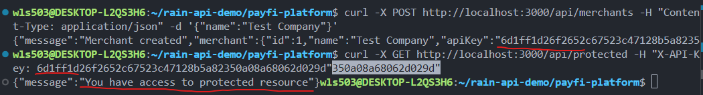

# PayFi Platform - Technical Documentation

## Overview

This is a personal learning project to understand Rain's payment infrastructure architecture, specifically their merchant integration, wallet management, fiat-to-stablecoin flows, card issuing, and webhook systems. Built as a reference implementation for studying fintech infrastructure patterns.

---

# Phase 1: Merchant Integration

## Why Create Merchants?

For a payment platform to function, external businesses need a way to join and access APIs. A merchant is simply a registered business that can make authenticated requests to the platform.

Without merchant registration, there's no entry point for businesses to use the payment infrastructure.

## Implementation: Merchant Registration

Create file structure:

```
mkdir src/routes
touch src/routes/merchants.ts
```

This file handles the merchant registration endpoint. When a business signs up, the system generates their API Key and stores their account.

**Test the endpoint:**

```bash
curl -X POST http://localhost:3000/api/merchants \
  -H "Content-Type: application/json" \
  -d '{"name":"Test Company"}'
```

**Success:** You receive a response with the merchant's generated API Key.

---

## Why API Key Authentication?

Once merchants register, the platform must verify every request actually comes from that merchant. An API Key acts as credentials—like a username/password, but for automated systems.

Without authentication, anyone could pretend to be a merchant and access their wallets or issue cards on their behalf.

## Implementation: Authentication Middleware

Create file:

```
mkdir src/middleware
touch src/middleware/auth.ts
```

This file contains two functions:

-   `registerApiKey()`: Stores a newly generated API Key when a merchant signs up
-   `apiKeyAuth()`: Middleware that checks if incoming requests have a valid API Key

Update `src/server.ts` to import the authentication middleware and create a protected test endpoint.

**Test authentication using the API Key from merchant registration:**

```bash
curl -X GET http://localhost:3000/api/protected \
  -H "X-API-Key: YOUR_API_KEY_HERE"
```

Replace `YOUR_API_KEY_HERE` with the actual API Key you received from the merchant registration response.

**Example:**


**Success:** You see the message "You have access to protected resource"

**Failure (without API Key or with invalid key):** You get a 401 or 403 error.

---

## What This Enables

-   Merchants can only access resources they own
-   All future features (wallets, cards, payments) can assume requests are from authenticated merchants
-   The platform has a security foundation for all protected endpoints

---

# Phase 2: Wallet System

## Why Wallet Management?

Once merchants are authenticated, the platform needs a place to store their funds. A wallet is a merchant's account balance on the platform—it tracks how much money they have available.

Without wallets:

-   All merchants' funds would mix together (no separation)
-   You couldn't validate if a merchant has enough balance before processing payments
-   There's no audit trail of who owns what

Wallets are the foundation for all financial operations: deposits, withdrawals, card issuance, and payments.

## Implementation: Create Merchant Wallet

Create file:

```
mkdir src/routes
touch src/routes/wallets.ts
```

This file handles wallet operations. When a merchant is created, they automatically get a wallet. The wallet stores their USDC balance (simulated stablecoin).

Key changes to existing code:

-   `auth.ts`: API Key registry now tracks `API Key → Merchant ID` mapping, so wallets know who owns them
-   `merchants.ts`: When registering API Key, we now pass the merchant ID for ownership tracking
-   `server.ts`: Import and register the new wallet routes

**Create merchant and view wallet:**

When a merchant signs up, they automatically receive a wallet with 0 USDC balance. View it using their API Key:

```bash
curl -X GET http://localhost:3000/api/wallets \
  -H "X-API-Key: YOUR_API_KEY_HERE"
```

**Example:**


---

## Why Wallet Ledger and Fund Movement?

A wallet without the ability to move funds is just a static number. Real payment platforms need merchants to deposit funds, withdraw funds, and track every transaction. This creates an audit trail and prevents fraud.

This stage introduces a basic ledger system. Merchants can now:

-   Top up wallet balance (deposits)
-   Spend from wallet balance (withdrawals)
-   Transfer funds to other merchants
-   View full transaction history
-   Automatic balance validation to prevent overspending

Every balance change is recorded as a transaction for auditability—this is how real financial systems track money movement.

## Implementation: Deposit, Withdraw, Transfer, Transactions

The wallet routes now include four new endpoints:

**Deposit funds into wallet:**

```bash
curl -X POST http://localhost:3000/api/wallets/deposit \
  -H "Content-Type: application/json" \
  -H "X-API-Key: YOUR_API_KEY" \
  -d '{"amount": 100}'
```

**Example:**


Success: Wallet balance increases, transaction recorded.

---

**Withdraw funds from wallet:**

```bash
curl -X POST http://localhost:3000/api/wallets/withdraw \
  -H "Content-Type: application/json" \
  -H "X-API-Key: YOUR_API_KEY" \
  -d '{"amount": 30}'
```

**Example:**


Success: Wallet balance decreases, transaction recorded.

---

**Transfer funds to another merchant:**

```bash
curl -X POST http://localhost:3000/api/wallets/transfer \
  -H "Content-Type: application/json" \
  -H "X-API-Key: MERCHANT_1_API_KEY" \
  -d '{"toMerchantId": 2, "amount": 30}'
```

**Example:**


Success: Merchant 1 transfers 30 to Merchant 2. Merchant 1 wallet drops from 100 to 70, Merchant 2 wallet increases to 30. Both transactions recorded in ledger.

---

**View transaction history (ledger):**

```bash
curl http://localhost:3000/api/wallets/transactions \
  -H "X-API-Key: YOUR_API_KEY"
```

Returns all deposits, withdrawals, and transfers for the merchant.

---

**Balance validation in action (insufficient funds):**

Try transferring more than available balance:

```bash
curl -X POST http://localhost:3000/api/wallets/transfer \
  -H "Content-Type: application/json" \
  -H "X-API-Key: MERCHANT_1_API_KEY" \
  -d '{"toMerchantId": 2, "amount": 300}'
```

Error: Transfer blocked. Merchant 1 only has 70 remaining, cannot transfer 300.

---

## What This Enables

-   Merchants can fund their wallets (top-up mechanism)
-   Merchants can spend from wallets (payment settlement)
-   Merchants can transfer funds to other merchants
-   Complete audit trail of all transactions
-   Risk management via balance validation
-   Foundation for card issuance and payment processing
