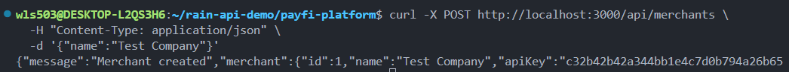

# PayFi Platform - Technical Documentation

## Product Vision

Enable fintech companies to onboard merchants and issue digital payment infrastructure in minutes, not weeks. PayFi abstracts away the complexity of payment rails, wallet management, and card issuing—allowing businesses to focus on customer experience.

---

## Phase 1: Merchant Onboarding ✓

### Problem Solved

When merchants want to integrate with a payment provider, they need:

-   A simple way to register their business
-   Immediate access credentials (API Key)
-   Ability to make authenticated API calls

### Solution

PayFi provides a one-step merchant registration that automatically generates secure API credentials.

### How It Works

**Endpoint:** `POST /api/merchants`

**Request:**

```json
{
    "name": "Test Company"
}
```

**Response:**

```json
{
    "message": "Merchant created",
    "merchant": {
        "id": 1,
        "name": "Test Company",
        "apiKey": "9a8f3c2e7b1d4f..."
    }
}
```

### What This Enables

-   Merchants can self-onboard without manual KYC delays
-   Each merchant gets a unique API Key for authentication
-   Foundation for wallet creation and payment processing

---

## Phase 2: API Key Authentication ✓

### Problem Solved

After merchants receive their API Key, we need a way to validate that requests actually come from authenticated merchants. Without this, anyone could impersonate a merchant and access their data.

### Solution Implemented

**In `src/routes/merchants.ts`:**
When a merchant is created, we now call `registerApiKey(apiKey)` to store the API Key in our authentication system. This creates a registry of valid keys that can be checked on every request.

Why this matters: The API Key needs to persist somewhere so the authentication middleware can validate it later.

**In `src/server.ts`:**
We added a protected endpoint `GET /api/protected` that requires valid API Key authentication. This endpoint demonstrates how authentication works—only requests with a valid API Key in the `X-API-Key` header will succeed.

Why this matters: This proves that our authentication middleware is working before we protect more critical endpoints like wallets and payments.

### What This Enables

-   Only authenticated merchants can access their data
-   API Key is validated on every protected request
-   Foundation for wallet and payment endpoints

### Proof of Concept

**Merchant Onboarding Test:**

