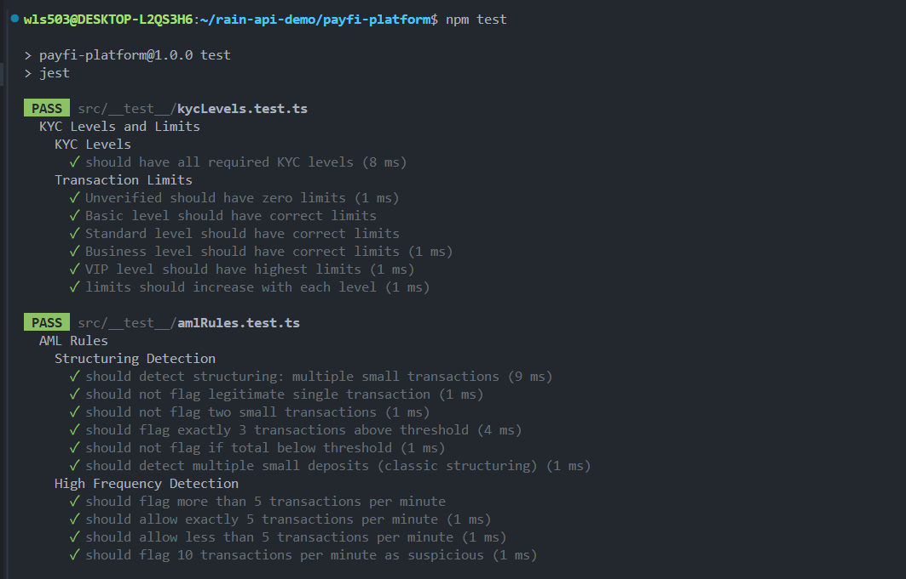
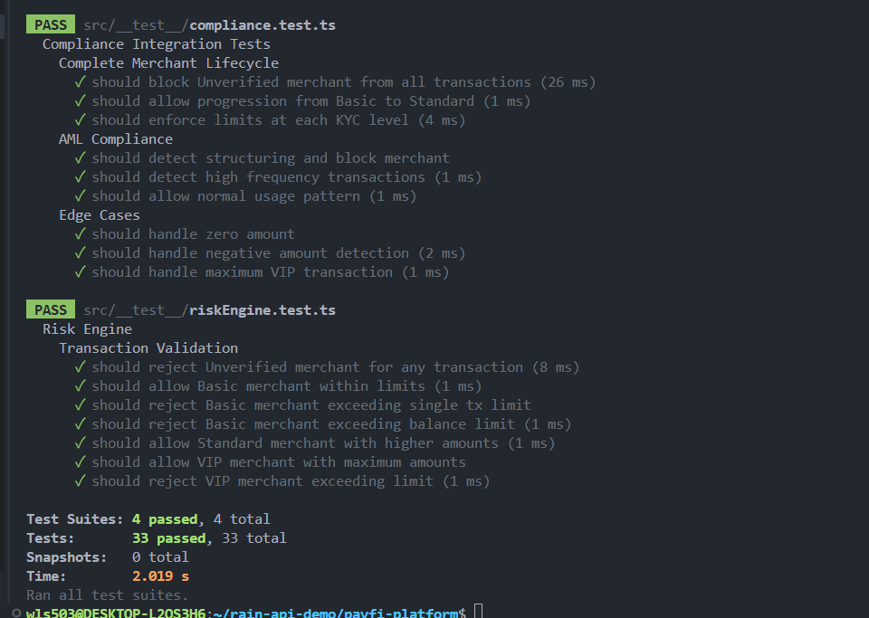
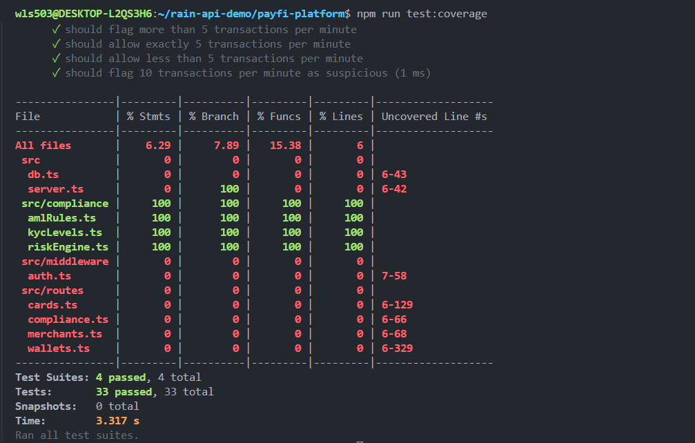

# PayFi Platform - Test Deployment Guide

## What We Did

Created 4 test files in `src/__tests__/`:

- `kycLevels.test.ts` - 7 tests
- `riskEngine.test.ts` - 7 tests
- `amlRules.test.ts` - 10 tests
- `compliance.test.ts` - 9 tests

**Total: 33 tests**

## Test Suites

### 1. KYC Levels (7 tests)

Tests that all 5 KYC levels exist and have correct transaction limits:

```
Unverified:  maxTx = 0,      maxBalance = 0
Basic:       maxTx = 100,    maxBalance = 500
Standard:    maxTx = 1000,   maxBalance = 5000
Business:    maxTx = 10000,  maxBalance = 50000
VIP:         maxTx = 100000, maxBalance = 500000
```

### 2. Risk Engine (7 tests)

Tests transaction validation logic:

- Unverified merchants rejected for all amounts
- Basic merchant with $50 → Approved
- Basic merchant with $150 → Rejected (exceeds $100 limit)
- Standard merchant with $1000 → Approved
- VIP merchant with $100,000 → Approved

### 3. AML Rules (10 tests)

Tests suspicious transaction detection:

- Structuring: 3+ transactions totaling > threshold = suspicious
- High frequency: 6+ transactions per minute = suspicious
- Legitimate patterns are not flagged

### 4. Compliance Integration (9 tests)

Tests complete merchant flow:

- Unverified merchant blocked from all transactions
- Merchants can upgrade KYC levels
- Each level enforces its limits
- AML detection works end-to-end
- Edge cases handled (zero, negative, max values)

## Test Results





**All tests pass:**

```
Test Suites: 4 passed, 4 total
Tests:       33 passed, 33 total
Time:        2.019 s
```

## How to Run Tests

### Run Once

```bash
npm test
```

Runs all tests once, shows results, exits.

### Watch Mode (Development)

```bash
npm run test:watch
```

Monitors files, automatically re-runs tests when you save code.

**Controls:**

- `a` - Run all tests
- `f` - Run failed tests only
- `q` - Quit

### Code Coverage

```bash
npm run test:coverage
```

Generates coverage report showing percentage of code tested.

## Coverage Report



**Coverage by file:**

```
src/compliance/
├── amlRules.ts       100% ✅
├── kycLevels.ts      100% ✅
└── riskEngine.ts     100% ✅
```

All business logic is fully tested.

## Development Workflow

### Quick Testing

```bash
npm test          # Run once
# Check results
# Fix any failures
npm test          # Run again
```

### Continuous Testing While Developing

```bash
# Terminal 1
npm run test:watch

# Terminal 2
# Edit code
# Tests automatically re-run
```

### Before Committing

```bash
npm test              # Verify all pass
npm run test:coverage # Check coverage
npm run build         # Verify compilation
git push              # Push if all pass
```

## CI/CD Integration

Tests automatically run on GitHub Actions when you:

- Push to `outstanding_projects` branch
- Modify files in `payfi-platform/` directory

Results show as:

- ✅ Green checkmark = All tests passed
- ❌ Red X = Tests failed

See [CICD_Deployment_Guide.md](./CICD_Deployment_Guide.md) for details.

## Expected Results After Each Push

```
✅ Test Suites: 4 passed, 4 total
✅ Tests: 33 passed, 33 total
✅ All compliance logic verified
✅ Code coverage: 100% on tested files
```

If you see failures, check the logs and fix locally before pushing again.
